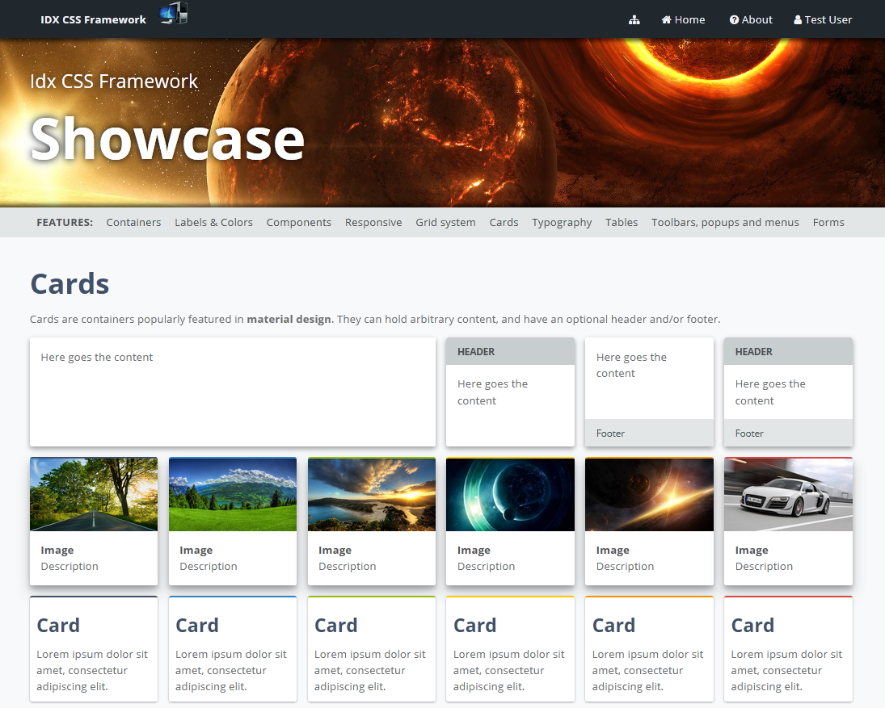
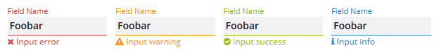

# IDX CSS Framework



## Features
- **SASS** (Syntactically Awesome StyleSheets) based **CSS3 framework**
- **Pure CSS**, no Javascript required at runtime.
- **Easy to customize**: start by changing the `theme-constants.scss` to derive your own theme, or add and alter styles to build your custom deviation.
- **Build**: **Gulp/NPM** build, builds the **minimized CSS**, and can boot **browser-sync** with auto-reload when editing styles.
- **Responsive** classes to style for multiple screen sizes / devices. Uses the same naming conventions (`xl`,`lg`,`md`,`sm`,`xs`) / media break points as Bootstrap.
- **Grid system**: 12-column responsive grid.
- **Cards**: card styles with optional headers, footers, and material design shadows
- **List** components
- **Popup** components, combined with the list components you can easily build **popup menus**.
- **Form field inputs**: modern approach to form styling.
- ...and many more, check out the **Showcase** (included) to learn about all the features.



## Setup (Node and NPM)
This project requires Node.js for the build process (download 'latest' from https://nodejs.org).

Install node module dependencies:
```
npm install
```
Install gulp on your system (run as admin user)
```
npm install -g gulp
```

## Build / Run with Gulp
Build and run local server (accessible on [http://localhost:4000](http://localhost:4000)):
```
gulp
```
Build only (target folder: `./build`):
```
gulp build
```